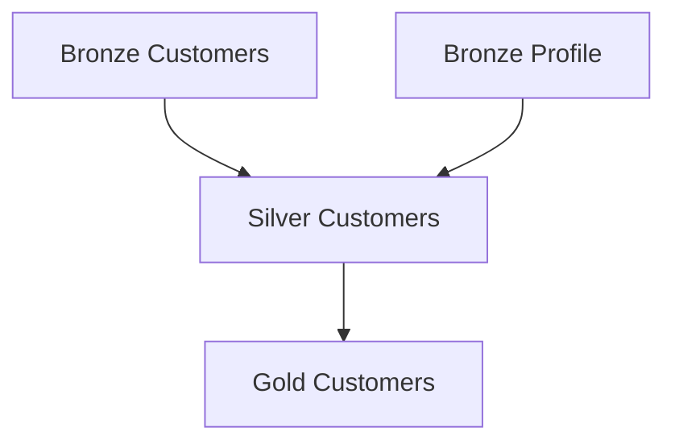

# tidylake {.hide}

--8<-- "docs/.partials/index-header.html"

## The Data Platform Balancing Act

Building a data platform is a constant struggle to balance three types of complexity:

- __Technical Stack:__ Managing storage, compute, and evolving tools.
- __Process:__ Handling orchestration, monitoring, and deployments.
- __People:__ Coordinating a diverse team—from Data Engineers and DevOps to Data Scientists and Governance leads.

### Why traditional approaches fail:

- __Too Engineering-Heavy:__ If you focus solely on complex orchestration frameworks, less technical users (Governance, Business Analysts) can’t contribute. This creates an engineering bottleneck that doesn't scale.

- __Too Governance-Heavy:__ If you rely on standalone documentation tools, they quickly become detached from the actual code. Syncing the two becomes an impossible manual task.

__tidylake__ provides the "common ground" for your data platform. Instead of choosing between code and documentation, __tidylake__ connects them.

We bridge the gap between governance documentation and process execution without forcing you to switch your favorite tools. It streamlines how you define assets, ensuring your metadata and your pipelines stay in perfect sync.

<!-- ## Why use tidylake

1. **Tool agnosting framework**:
tidylake only helps you define your assets and provide a non opinionated framework for the remaining part of the processes like, reading, transforming, storing or testing your data.

2.  -->

## Your first project

Follow this minimal example to understand the [core mechanics](design-principles.md) of a tidylake project.

In this guide, we will build a single [data product](design-principles.md#data-product), the fundamental building block of tidylake. It is an abstraction that allows you to define where your data comes from and what it should look like (metadata), then "wire it up" to your actual processing logic using our helpers.

!!! note "The Philosophy: Organization over Interference" 
    tidylake is an unopinionated framework. By structuring your scripts and defining your data products, you unlock powerful tooling and automation. However, tidylake does not modify your data or add features to your processing engine (like [pandas](https://pandas.pydata.org) in this example) or filesystem. It is designed for organization and governance, leaving the data processing entirely to you. Our [plugin system](plugins/overview.md) allows you for more flexibility and integration of your chosen framework.


### The Manifest File

Every data product begins with a [manifest](manifests.md). This is a standardized YAML schema that acts as the "source of truth" for your metadata.

```yaml {title=silver_customers.yaml}
data_product:
    name: 'silver_customers' # (1)
    description: Customer profile from the CRM database  
    script: 'silver_customers' # (2)
    schema: # (3)
        properties:
            customer_id:
                type: 'string'
                desc: 'Unique identifier for the customer'
            customer_name:
                type: 'string'
                desc: 'Full name of the customer'
            customer_active:
                type: 'boolean'
                desc: 'Flag indicating if the customer account is active'
            customer_city:
                type: 'string'
                desc: 'City where the customer is located'
```

1. __Identity__: Reusable metadata used for documentation and CLI commands.
2. __Binding__: Links this metadata directly to the Python logic.
3. __Contract__: Used for data quality validation and automating table definitions in your data warehouse.

### The Context File

Tidylake uses a global [context file](context.md) to discover which data products belong to your project. The following is a minimal example including the previous data product.

```yaml {"title="tidylake.yaml"}
tidylake:
  name: Hello World
  include_data_products:
    - silver_customers.yml
```

### The Script File

This is where you implement your logic (reading, transforming, and storing data). Tidylake stays out of your way, letting you use standard Python.

```python {title="silver_customers.py"}
# %% 
# (1)!
import pandas as pd

from tidylake import get_or_create_context

data_product = get_or_create_context().get_data_product("silver_customers") # (2)!

# %%
@data_product.add_input() # (3)!
def bronze_customers():
    return pd.read_parquet("/tmp/bronze_customers")

df_bronze_customers = bronze_customers()

# %%
df_silver_customers = (
    df_bronze_customers.loc[lambda df: df["customer__active"]]
    .assign(
        customer_city=lambda df: df["customer_city"].str.upper(),
        customer_name=lambda df: df["customer_name"].str.title(),
    )
    # (4)!

# %%
@data_product.set_sink() # (5)!
def write_silver_customers():
    return df_silver_customers.to_parquet("/tmp/silver_customers", index=False)
```

1. __Context Awareness:__ Works in both interactive (Notebooks) and batch (Production) modes.
2. __Lineage:__ Automatically tracks where data comes from.
3. __More Lineage:__ Automatically tracks dependencies with other data products
4. __Freedom:__ Tidylake doesn't change how you write Pandas/Spark code.
5. __Safety:__ Sinks can be disabled in development to prevent accidental data overwrites.

### Repeat!

Scaling your project is simply a matter of repeating this three-step workflow for every new asset:

1. __Define__ the schema and metadata in a manifest file.
2. __Implement__ the logic in a script, linking it to the manifest.
3. __Register__ the product in your context file.

!!! example "Run the complete example yourself" 
    The snippets above are simplified for clarity. You can find the full, runnable project—including the sample data and all five data products [here](demos/pandas-local.md).

!!! note "The Medallion Architecture" 
    In the following examples, you will see us using terms like _Bronze_, _Silver_, and _Gold_. While tidylake is architecture-agnostic, we recommend adhering to a methodology such as the [medallion architecture](https://www.databricks.com/glossary/medallion-architecture), as it is used along our documentation because it is a proven standard for organizing data products.


### Using tidylake's Tooling

Once your project is structured, tidylake unlocks powerful automation and safety features via its [Command Line Interface (CLI)](cli.md).

#### Introspect the Lineage Graph

Tidylake parses your scripts to build an internal Directed Acyclic Graph (DAG). It automatically detects dependencies by looking at which products are used as inputs for others.

Use the [tidylake list](cli.md#list) command to see your data products in their correct execution order:

```bash
uv run tidylake list

01. bronze_customers
02. bronze_profile
03. silver_customers
04. gold_customers
```

!!! note "Automatic DAG Validation" 
    The order above is determined by script dependencies, not the order in your configuration file. Tidylake ensures the graph is valid and will fail early if it detects circular dependencies. Learn more about [detecting data product dependencies](context.md#dag).

You can also generate a visual representation of your pipeline using [Mermaid](https://mermaid.ai) syntax:

```bash
uv run tidylake list --mermaid
```



#### Execution in Batch Mode

During testing, in production or in CI/CD environments, you will run the project in batch mode. This tells tidylake to execute the scripts in order and activates all Sinks to write data to your storage layer.

Use the [tidylake run](cli.md#run) command to run the entire project or a specific subset:

```bash
$ tidylake run

⚡️ Running data product: bronze_customers
⚡️ Running data product: bronze_profile
⚡️ Running data product: silver_customers
⚡️ Running data product: gold_customers
```

#### Development in Interactive Mode

One of the most powerful features of tidylake is its "_context awareness_." You can run the exact same scripts interactively (using IPython kernels, Jupyter notebooks, or VS Code interactive windows) without modification.

When tidylake detects an interactive session, it shifts into safety mode:

- __Disabled Sinks:__ The [`sink`](scripts.md#writing-data) functions are bypassed. You can run your script as many times as you like without accidentally overwriting production data or creating "spurious" files.
- __Quiet Logging:__ Production-level logging is silenced to keep your console clean for development.

This allows you to develop logic interactively while retaining the exact same code that will eventually run in production as a scheduled batch job, see more by reading the (notebook vs script dilemma)[#batch-vs-interactive] design principle.

!!! tip "Agnostic to your environment" 
    While we use .py files with [vscode jupyter code cells](https://code.visualstudio.com/docs/python/jupyter-support-py#_jupyter-code-cells) in this guide, tidylake works with any interactive Python environment. Remember, it’s about the methodology, not the IDE.

### Next Steps: Leveling Up Your Workflow

You have now seen the core mechanics of tidylake: linking metadata to logic and managing execution contexts.

However, there is much more to explore. You can continue through the guide in order (start with the [core concepts guide](design-principles.md)), or jump straight into the features that interest you most:

- Go beyond basic pandas, learn how to create a [compute engine plugin](plugins/compute-engine.md) to encapsulate I/O operations, enable [schema automation](plugins/compute-engine.md#schema-automation) for your data lake, or generate [synthetic data](plugins/compute-engine.md#synthetic-data) directly from your manifests for rapid testing.
- __(WIP)__ Discover how to implement and log data quality tests as a native part of your product lifecycle.
- __(WIP)__ See how to export your tidylake DAG and integrate it seamlessly with orchestration engines like Airflow, Dagster, or Prefect.

You can also go straight to the [demos](demos/demos.md) to see examples of complete projects for a variety of frameworks.